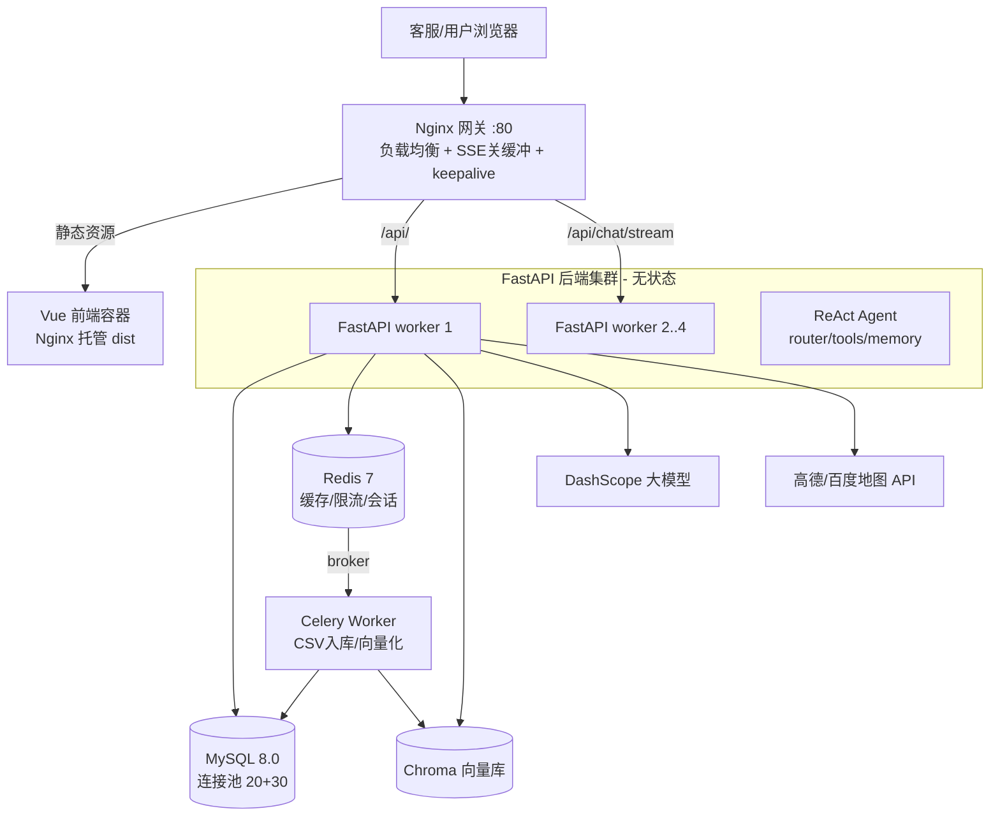

# 智扫通智能客服 v2

> 面向「扫地机器人」售后场景的智能客服系统。客服人员（或自动客服）用一句大白话提问，系统背后的 **ReAct 智能体** 会自己判断该查知识库、查客户档案，还是调地图/天气工具，并以**流式（打字机）**方式把答案吐出来。

本 README 面向**完全没接触过本项目的同学**，照着做就能跑起来。

---

## 1. 项目简介

智扫通 v2 在原型版基础上做了四大改造，从「一问一答的聊天框」升级为「能调用工具、能查业务数据、能记住老客户」的智能客服：

1. **ReAct 智能体**：不再写死问答规则，由大模型自己「思考 → 选工具 → 观察结果 → 再回答」（见 `backend/app/agent/react_agent.py`）。
2. **RAG 知识库**：把扫地机器人保养/故障文档切片向量化，回答时先检索再生成，减少胡说。
3. **客户数据查询（Text2SQL）**：用自然语言直接查 MySQL 里的客户档案（如「深圳金卡用户有谁」），并接入高德/百度地图查地址、天气、附近维修点。
4. **长期记忆**：自动记住客户偏好（如「对噪音敏感」「养宠物」），下次会话自动召回。

工程上同步做了**高并发改造**：全异步 IO、数据库连接池、无状态可水平扩展、Celery 削峰、Nginx 负载均衡。

---

## 2. 技术栈总览

| 层 | 技术选型 | 说明 |
|---|---|---|
| 前端 | Vue 3 + Vite + Pinia + Vue Router | SPA，聊天页流式渲染；构建后由 Nginx 托管静态文件 |
| 后端 | Python 3.11 + FastAPI + Uvicorn(ASGI) | 全 `async/await`，默认 4 个 worker |
| 数据库 | MySQL 8.0 | SQLAlchemy 2.0 异步 ORM + aiomysql 驱动 |
| 缓存 / 计数 | Redis 7 | 缓存、限流计数器、Celery broker/backend |
| 异步任务 | Celery 5 + Redis | CSV 入库、向量入库等重任务削峰 |
| AI 框架 | LangChain 0.3 + LangGraph | ReAct 智能体编排 |
| 大模型 | 阿里通义千问 DashScope | 对话 `qwen3-max`，向量 `text-embedding-v4` |
| 向量库 | Chroma | 本地持久化知识库向量检索 |
| 外部工具 | 高德 / 百度开放平台 API | 地理编码、逆地理编码、天气、周边 POI |
| 部署 | Docker Compose + Nginx | 一键起全套；Nginx 做负载均衡 + SSE 优化 |

---

## 3. 系统架构图



---

## 4. 目录结构

```
smart-agent-v2/
├── docker-compose.yml          # 一键编排：MySQL/Redis/backend/celery/frontend/nginx
├── .env.example                # 环境变量模板（复制为 .env 后填写）
├── README.md                   # 本文件
├── backend/                    # FastAPI 后端
│   ├── Dockerfile
│   ├── requirements.txt        # Python 依赖清单
│   └── app/
│       ├── main.py             # 应用入口（创建 FastAPI、挂路由）
│       ├── config.py           # pydantic-settings 统一读 .env
│       ├── database.py         # 异步引擎 + 连接池 + get_db 依赖
│       ├── agent/              # ReAct 智能体：react_agent / tools / memory
│       ├── api/                # 路由：auth、deps(鉴权依赖) 等
│       ├── models/             # SQLAlchemy ORM 模型（客户/会话/记忆/数据集…）
│       ├── schemas/            # Pydantic 请求/响应模型
│       ├── repositories/       # 数据访问层（把 SQL 封装在这里）
│       ├── services/           # 业务层：chat/customer/text2sql/dataset…
│       ├── rag/                # RAG：检索服务 + Chroma 向量库
│       ├── tasks/              # Celery 异步任务定义
│       └── utils/              # 安全/CSV/日志等工具
├── frontend/                   # Vue3 + Vite 前端
│   ├── src/api/                # 后端接口封装（auth/chat/customer/tool/dataset）
│   ├── src/views/              # 页面：登录、聊天…
│   ├── src/stores/             # Pinia 状态
│   └── Dockerfile
├── deploy/
│   ├── nginx/nginx.conf        # 网关配置：负载均衡/SSE 关缓冲/超时
│   └── locust/                 # 高并发压测脚本 locustfile.py
├── sql/init.sql                # 建库建表 + 种子数据（admin/admin123、示例客户）
├── data/                       # 运行期数据：knowledge 知识库、uploads 上传、chroma
└── docs/
    ├── 开发指南-小白全流程.md       # 从零到跑通的开发笔记
    └── 高并发技术方案.md            # 高并发问题→原理→配置→验证 系统文档
```

---

## 5. 快速开始

### 方式一：Docker Compose 一键启动（推荐）

> 前置：装好 Docker Desktop。

```bash
# 1) 进入项目根目录
cd smart-agent-v2

# 2) 复制环境变量模板，然后编辑 .env 填入真实 key
cp .env.example .env

# 3) 启动全部服务（首次会拉镜像 + 构建，需要几分钟）
docker-compose up -d

# 4) 查看状态 / 日志
docker-compose ps
docker-compose logs -f backend
```

启动后访问：**http://localhost** （Nginx 网关统一入口）。

- 后端直连：http://localhost:8000 ，Swagger 文档 http://localhost:8000/docs
- 前端独立容器：http://localhost:8080

> 第一次启动 MySQL 会自动执行 `sql/init.sql` 建表并写入种子数据。

### 方式二：手动启动（没有 Docker 时）

1. **装 MySQL 8.0**，建库并初始化：
   ```bash
   mysql -u root -p < sql/init.sql
   ```
2. **装 Redis 7**，默认 `127.0.0.1:6379` 启动。
3. **配置后端**：
   ```bash
   cp .env.example .env          # 填入 MySQL/Redis 密码、DASHSCOPE_API_KEY
   cd backend
   python -m venv .venv
   # Windows: .venv\Scripts\activate   |  macOS/Linux: source .venv/bin/activate
   pip install -r requirements.txt
   uvicorn app.main:app --reload --port 8000
   ```
4. **启动 Celery（可选，做 CSV 导入时需要）**：
   ```bash
   celery -A app.tasks.celery_app.celery worker --loglevel=info
   ```
5. **启动前端**：
   ```bash
   cd frontend
   npm install
   npm run dev        # 默认 http://localhost:5173
   ```

### 默认账号

| 用户名 | 密码 | 说明 |
|---|---|---|
| `admin` | `admin123` | 初始化脚本写入的管理员 |

> ⚠️ **上线前务必改掉这个默认密码**，并换掉 `JWT_SECRET_KEY`。

---

## 6. 环境变量说明（`.env`）

| 变量 | 含义 | 示例 |
|---|---|---|
| `MYSQL_HOST/PORT/USER/PASSWORD/DATABASE` | MySQL 连接信息 | host 容器内填 `mysql`，本地填 `127.0.0.1` |
| `REDIS_HOST/PORT/PASSWORD/DB` | Redis 连接信息 | 容器内填 `redis` |
| `DASHSCOPE_API_KEY` | 通义千问大模型 Key（**必填**，否则聊天不可用） | `sk-xxxx` |
| `CHAT_MODEL_NAME` | 对话模型名 | `qwen3-max` |
| `EMBEDDING_MODEL_NAME` | 向量模型名 | `text-embedding-v4` |
| `AMAP_KEY` / `AMAP_SECURITY_CODE` | 高德地图 Key（用地图工具时填） | Web 服务 Key |
| `BAIDU_MAP_AK` / `BAIDU_MAP_SK` | 百度地图 AK/SK（可选） | — |
| `JWT_SECRET_KEY` | JWT 签名密钥（**生产必须改**） | 随机长字符串 |
| `JWT_ALGORITHM` | JWT 算法 | `HS256` |
| `JWT_ACCESS_TOKEN_EXPIRE_MINUTES` | Token 有效期（分钟） | `1440`（1 天） |
| `APP_HOST/PORT/ENV` | 监听地址/端口/环境 | `production` |
| `LOG_LEVEL` | 日志级别 | `INFO` |
| `CHROMA_PERSIST_DIR` | 向量库落盘目录 | `./data/chroma_db` |
| `CHROMA_COLLECTION` | Chroma 集合名 | `agent_knowledge` |
| `CELERY_BROKER_URL` | Celery 消息代理 | `redis://...:6379/1` |
| `CELERY_RESULT_BACKEND` | Celery 结果存储 | `redis://...:6379/2` |

---

## 7. 四大功能模块说明

1. **ReAct 流式聊天** —— 接收用户问题，智能体循环「思考→选工具→执行→回答」，通过 SSE 逐字推送。
   关键文件：`backend/app/agent/react_agent.py`、`backend/app/services/chat_service.py`、接口 `POST /api/chat/stream`。

2. **RAG 知识库问答** —— 把 `data/knowledge` 下的扫地机器人文档切片、向量化存入 Chroma，回答前先召回相关片段，减少幻觉。
   关键文件：`backend/app/rag/rag_service.py`、`backend/app/rag/vector_store.py`、工具 `rag_summarize`。

3. **客户数据查询（Text2SQL + 地图工具）** —— 自然语言转 SQL 查客户档案，并可调用高德/百度的地理编码、天气、周边维修点工具。
   关键文件：`backend/app/services/text2sql_service.py`、`backend/app/services/data_router.py`、`backend/app/agent/tools/`。

4. **长期记忆** —— 从对话中抽取客户偏好/事实做向量嵌入保存，新会话按相似度召回，让客服「记得住老客户」。
   关键文件：`backend/app/services/memory_service.py`、`backend/app/repositories/memory_repo.py`、表 `long_term_memories`。

> 另外，**CSV 数据集导入**这种重活由 Celery 异步执行，前端轮询任务进度（表 `async_tasks`），不阻塞聊天主链路。

---

## 8. API 接口概览

| 方法 | 路径 | 鉴权 | 说明 |
|---|---|---|---|
| POST | `/api/auth/login` | 否 | 表单登录（username/password），返回 access_token |
| POST | `/api/auth/register` | 是 | 新建用户（管理员） |
| GET | `/api/auth/me` | 是 | 获取当前登录用户 |
| POST | `/api/chat/stream` | 是 | **SSE 流式聊天**，body 含 conversation_id/customer_id/query |
| GET | `/api/customers` | 是 | 客户列表 |
| GET | `/api/tools` | 是 | 可用工具列表 |
| GET | `/api/datasets` | 是 | 数据集列表 |
| GET | `/health` | 否 | 健康检查，返回 `ok` |

> 所有鉴权接口请在请求头加：`Authorization: Bearer <access_token>`。

---

## 9. 高并发方案（速览）

本项目从设计上为高并发做了如下准备，**完整原理、参数与验证方法见 [`docs/高并发技术方案.md`](docs/高并发技术方案.md)**：

- **全链路异步 IO**：FastAPI + async/await，IO 等待时让出事件循环。
- **数据库连接池**：`pool_size=20, max_overflow=30, pool_pre_ping=True`。
- **无状态水平扩展**：JWT 鉴权、session 不落地内存，多 worker + Nginx upstream 直接加机器。
- **Celery 削峰填谷**：CSV 入库、向量化等重任务异步化，不拖垮在线请求。
- **限流降级**：基于 Redis 令牌桶 + slowapi，保护外部 LLM/DB。
- **Nginx 负载均衡**：upstream keepalive、SSE 关闭 `proxy_buffering`、调大超时。

压测脚本在 `deploy/locust/locustfile.py`，用法见文件头注释。

---

## 10. 常见问题 FAQ

**Q1：后端连不上 MySQL / 报 `Can't connect to MySQL server`**
- 原因：Docker 里后端用的是服务名 `mysql`，本地直连用的是 `127.0.0.1`；或 MySQL 还没就绪后端就起来了。
- 解决：确认 `.env`/compose 里 `MYSQL_HOST` 写对；compose 已配 `depends_on: service_healthy`，若仍报错执行 `docker-compose restart backend`；本地手动起时先确认 `mysql -u root -p` 能登。

**Q2：连不上 Redis / `Error 111 Connection refused`**
- 原因：Redis 没启动，或 host 写成了 `127.0.0.1`（容器内应该是 `redis`）。
- 解决：`docker-compose ps` 看 redis 是否 Up；本地先 `redis-cli ping` 应返回 `PONG`。

**Q3：调用地图工具报「INVALID_USER_KEY / 鉴权失败」**
- 原因：`AMAP_KEY`（或百度 AK/SK）没填、填错，或额度/白名单限制。
- 解决：去开放平台核对 Key；高德 2021 年后申请的 Key 可能需要安全密钥；服务端调用注意用「Web 服务」类型 Key，不是 JS API Key。

**Q4：聊天不是流式的，答案憋半天一次性蹦出来**
- 原因：链路中间某层开了响应缓冲。Nginx 已配置 `location /api/chat/stream { proxy_buffering off; }`，若你改了网关或又套了一层代理，缓冲会把 SSE 攒着发。
- 解决：确认 SSE location 下 `proxy_buffering off; proxy_cache off;`，并把 `proxy_read_timeout` 调到 300s 级别。

**Q5：前端接口 404 / 跨域 CORS 报错**
- 原因：直连前端 dev server（5173）调 8000 会跨域；或请求路径少了 `/api` 前缀。
- 解决：生产走 Nginx 网关（同源）；开发环境用 Vite proxy 把 `/api` 代理到 `127.0.0.1:8000`；确认后端已配置 CORS 中间件允许前端来源。

**Q6：上传 CSV 后中文乱码 / 列名错位**
- 原因：CSV 是 GBK 编码，程序按 UTF-8 读了。
- 解决：项目已用 `chardet` 自动探测编码（见 `backend/app/utils/csv_helper.py`）；若仍乱码，把 CSV 另存为 UTF-8 with BOM 再传，或检查分隔符是不是逗号。

**Q7：`pip install -r requirements.txt` 装失败**
- 原因：`chromadb`/`grpcio` 等带原生编译；或 `langchain` 相关包版本没对齐。
- 解决：用 Python 3.10/3.11；先升级 pip（`python -m pip install -U pip`）；国内网络可加 `-i https://pypi.tuna.tsinghua.edu.cn/simple`；不要随意升降 langchain 大版本（代码按 0.3.x 中间件 API 写的）。

**Q8：端口被占用 / `port is already allocated`**
- 原因：本机已有程序占了 80、8000、8080、3306、6379。
- 解决：Windows 用 `netstat -ano | findstr :80` 找到 PID 后结束，或在 `docker-compose.yml` 改映射端口（如把 `"80:80"` 改成 `"8088:80"`）。

**Q9：Docker 里 backend 起来了但一直报 MySQL/Redis 连接失败**
- 原因：MySQL/Redis 容器还在初始化，后端抢跑。
- 解决：compose 已配健康检查与 `depends_on: condition: service_healthy`；若仍异常，`docker-compose down` 后重新 `up -d`，并观察 `docker-compose logs mysql` 是否初始化完成。

**Q10：登录后接口一直 401 Unauthorized**
- 原因：token 过期、没带 `Authorization: Bearer ` 头，或 `JWT_SECRET_KEY` 在多实例间不一致。
- 解决：重新登录拿新 token；确认请求头格式是 `Bearer <token>`（Bearer 后有空格）；生产环境所有 worker/网关要用同一个 `JWT_SECRET_KEY`。

---

更多开发细节见 [`docs/开发指南-小白全流程.md`](docs/开发指南-小白全流程.md)。
